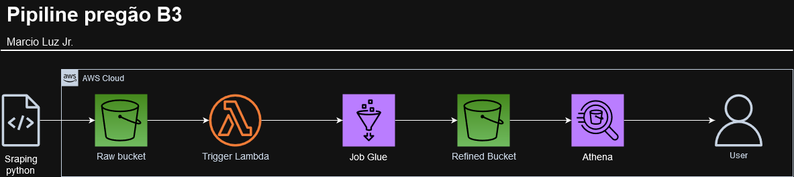

# Tech Challenge (TC) Marcio Luz Jr.

Este repositório contém a implementação do Tech Challenge. O projeto está dividido em quatro atividades principais, descritas abaixo.

- Realizar scrap do pregão do dia no site da B3 (https://sistemaswebb3-listados.b3.com.br).
- Processar o arquivo baixado.
- Submeter o arquivo processado em um carregamente em batch com a AWS.


## Estrutura do Projeto

- `get_file.py`: Utiliza Selenium para fazer o download do arquivo do pregão do site da B3 (https://sistemaswebb3-listados.b3.com.br).
- `process_file.py`: Processa o arquivo CSV baixado da B3 para um CSV intermediário, tratando e limpando caracteres inválidos.
- `create_parquet.py`: Cria um arquivo Parquet utilizando pandas, criando um DataFrame para processar os dados e salvando-os em um arquivo Parquet.
- `upload_to_aws.py`: Submete o arquivo Parquet para a AWS, em um bucket chamado `fiap-tc-fase2-ml/RAW`.

## Pré-requisitos

- Python 3.10 ou maior.
- Virtualenv

## Instruções de Instalação

### Windows

1. Clone o repositório:
   ```sh
   git clone https://github.com/seu-usuario/seu-repositorio.git
   cd seu-repositorio
2. Crie um ambiente virtual:
    ```sh
    python -m venv venv
3. Ative o ambiente virtual:
   ```sh
   .\venv\Scripts\activate
4. Instala as dependencias:
   ```sh
    pip install -r requirements.txt

### Linux

1. Clone o repositório:
   ```sh
   git clone https://github.com/seu-usuario/seu-repositorio.git
   cd seu-repositorio
2. Crie um ambiente virtual:
    ```sh
    python3 -m venv venv
3. Ative o ambiente virtual:
    ```sh
    source venv/bin/activate
4. Instale as dependências:
    ```sh
    pip install -r requirements.txt

### Crie a seguinte estrutura na raiz do projeto
```shell
├── docs
│   ├── 01csv
│   ├── 02processed_csv
│   ├── 03parquet
```

### Implementação com AWS.

Para fornecer as credencias utilize um arquivo separado em /~.aws/credentials.

### Diagrama contemplado.

